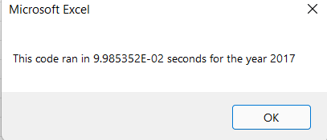
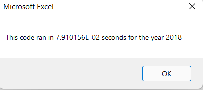

# stock-analysis
Green energy company stock analysis using VBA

## Overview of Project
The purpose of this analysis was to refactor a VBA code that was used to analyze Green Energy Stocks in years 2017 and 2018 to determine which ones were best to invest in. After refactoring the code, performance of stock analysis was assessed based on completion time and stock performance for 2017 and 2018 were also assessed.

## Results
Refactoring the original VBA script led to significantly quicker stock analysis performance run times for years 2017 & 2018 compared to the original VBA script, as intended. A comparison of analysis running times between the original and refactored scripts for 2017 and 2018 stocks are presented in the images below:

##### (Figure A) 2017 stock analysis run time from original VBA script

##### (Figure B) 2017 stock analysis run time from refactored VBA script

Refactored script run time = 0.09985352 seconds compared to the original script = 0.6640625 seconds. The refactored code ran the stock analysis __85%__ quicker than the original script!

##### (Figure C) 2018 stock analysis run time from original VBA script

##### (Figure D) 2018 stock analysis run time from refactored VBA script

Refactored script run time = 0.07910156 seconds compared to the original script = 0.6523438  seconds. The refactored code ran the stock analysis__85%__ quicker than the original code!

With the refactored code clearly running more efficiently, the following is the full refactored script:

Sub AllStocksAnalysisRefactored()

    Dim startTime As Single
    Dim endTime  As Single

    yearValue = InputBox("What year would you like to run the analysis on?")

    startTime = Timer
    
    'Format the output sheet on All Stocks Analysis worksheet
    Worksheets("All Stocks Analysis").Activate
    
    Range("A1").Value = "All Stocks (" + yearValue + ")"
    
    'Create a header row
    Cells(3, 1).Value = "Ticker"
    Cells(3, 2).Value = "Total Daily Volume"
    Cells(3, 3).Value = "Return"

    'Initialize array of all tickers
    Dim tickers(12) As String
    
    tickers(0) = "AY"
    tickers(1) = "CSIQ"
    tickers(2) = "DQ"
    tickers(3) = "ENPH"
    tickers(4) = "FSLR"
    tickers(5) = "HASI"
    tickers(6) = "JKS"
    tickers(7) = "RUN"
    tickers(8) = "SEDG"
    tickers(9) = "SPWR"
    tickers(10) = "TERP"
    tickers(11) = "VSLR"
    
    'Activate data worksheet
    Worksheets(yearValue).Activate
    
    'Get the number of rows to loop over
    RowCount = Cells(Rows.Count, "A").End(xlUp).Row
    
    '1a) Create a ticker Index
    Dim tickerIndex as Single
    tickerIndex=0
    

    '1b) Create three output arrays   
    Dim tickerVolumes(12) as Long
    Dim tickerStartingPrices(12) as Single
    Dim tickerEndingPrices(12) as Single
    
    ''2a) Create a for loop to initialize the tickerVolumes to zero. 
    For i = 0 to 11

    tickerVolumes(i) = 0

    Next i
         
    ''2b) Loop over all the rows in the spreadsheet. 
    For J = 2 To RowCount
    
        '3a) Increase volume for current ticker
        'If  Then

        tickerVolumes(TickerIndex) = tickerVolumes(TickerIndex) + Cells(J, 8).Value

        '3b) Check if the current row is the first row with the selected tickerIndex.
        'If  Then
        If Cells(J - 1, 1).Value <> tickers(TickerIndex) Then
         tickerStartingPrices(TickerIndex) = Cells(J, 6).Value
        
        End If

        'End If
        
        '3c) check if the current row is the last row with the selected ticker
         'If the next row’s ticker doesn’t match, increase the tickerIndex.
        'If  Then
       If Cells(J + 1, 1).Value <> tickers(tickerIndex) Then
        tickerEndingPrices(tickerIndex) = Cells(J, 6).Value

            '3d Increase the tickerIndex. 
            tickerIndex = tickerIndex + 1

            End If
        'End If
        Next J
   
    
    '4) Loop through your arrays to output the Ticker, Total Daily Volume, and Return.
    For i = 0 To 11
        
        Worksheets("All Stocks Analysis").Activate
        tickerIndex = i
        Cells(i+ 4, 1).Value = tickers(TickerIndex)
        Cells(i + 4, 2).Value = tickerVolumes(TickerIndex)
        Cells(i + 4, 3).Value = (tickerEndingPrices(TickerIndex) / tickerStartingPrices(TickerIndex)) - 1
        
    Next i
    
    'Formatting
    Worksheets("All Stocks Analysis").Activate
    Range("A3:C3").Font.FontStyle = "Bold"
    Range("A3:C3").Borders(xlEdgeBottom).LineStyle = xlContinuous
    Range("B4:B15").NumberFormat = "#,##0"
    Range("C4:C15").NumberFormat = "0.0%"
    Columns("B").AutoFit

    dataRowStart = 4
    dataRowEnd = 15

    For i = dataRowStart To dataRowEnd
        
        If Cells(i, 3) > 0 Then
            
            Cells(i, 3).Interior.Color = vbGreen
            
        Else
        
            Cells(i, 3).Interior.Color = vbRed
            
        End If
        
    Next i
 
    endTime = Timer
    MsgBox "This code ran in " & (endTime - startTime) & " seconds for the year " & (yearValue)

End Sub

## Summary
### Advantages
Somes advantages to refactoring code include cleaning up the code such as removing any redundancies. This is better for reuse and to be updated by others over time. Consequently, the liklihood of encountering errors will be reduced. Refactoring also makes the code easier to read and maintain. Lastly, as demonstrated in this assignment, the analysis running time on this refactored code script was quicker because the data was only looped one time to gather the needed stock performance information.
### Disadvantages
While there are plenty of advantages to refactoring code, there are some disadvantages. Refactoring code requires extensive experience and time to avoid introducing other issues. While the make up of the code maybe improved, its functional analysis remains the same and no new functions can be added into the code as part of the refactoring prcess. 
### Advantages & Disadvanges to refactoring original VBA script
One clear advantage of refactoring the original VBA script was the improved performance in analyzing the stocks. Another advantage was looking up codes on this platform posted by previous students and I already saw how my refactored code is different where I used a nested for loop in my script while the ones I encountered just used a for loop, which appeared to look visually cleaner, and therefore easier to read and understand.  A disadvantage of refactoring is the extensive time it requires along with experience, which I am limited in both due to the nature of the boot camp.
